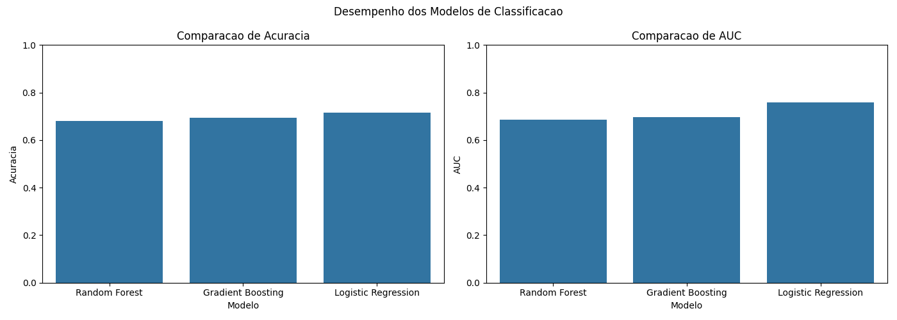
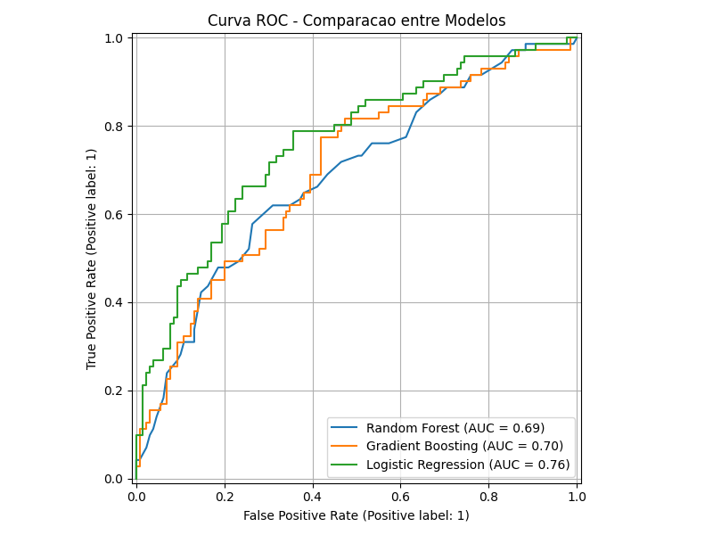
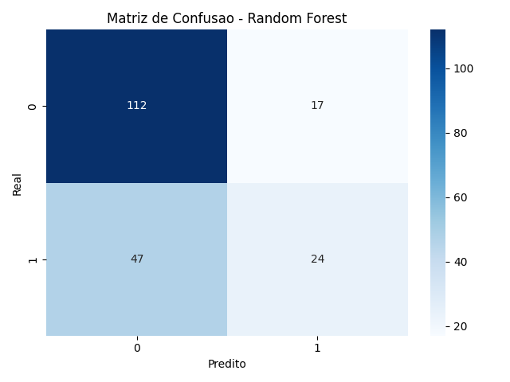
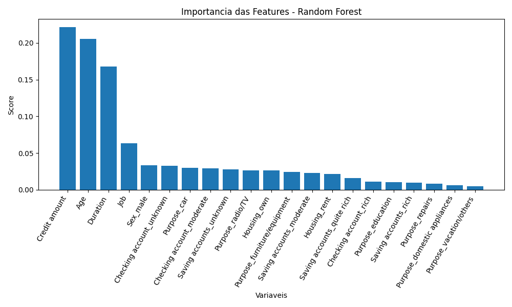

# Análise de Risco de Crédito — Comparative Study

[](https://github.com/murillosezerino/analise-risco-credito/actions/workflows/ci.yml)


> Technical study: comparative evaluation of three classical ML models for credit risk classification, with cross-validation on the best performer.

A focused exercise in baseline modeling for credit risk. Three models — Random Forest, Gradient Boosting and Logistic Regression — are trained on the same dataset and evaluated head-to-head on accuracy, AUC-ROC and confusion matrix. The best model is then validated with k-fold cross-validation and feature importance is examined.

This project is the *baseline study* that preceded my [credit-scoring](https://github.com/murillosezerino/credit-scoring) ensemble work — useful as a side-by-side comparison of single-model approaches versus stacking.

## What this project explores

- **Three-model comparison** on the same training data
- **Evaluation metrics** beyond accuracy: AUC-ROC, confusion matrix, comparative ROC curves
- **Cross-validation** on the best model
- **Feature importance** analysis

## Stack

`Python` · `Scikit-Learn` · `Pandas` · `NumPy` · `Matplotlib` · `Seaborn`

## What's inside

```
analise-risco-credito/
├── src/
│   └── analise_risco_credito.py   # preprocess (one-hot + scale), treino dos 3 modelos, plots
├── scripts/
│   └── make_dataset.py            # gera o dataset sintetico (schema German Credit)
├── dados/
│   └── dados_credito.csv          # dataset sintetico, valores crus (categoricas em texto)
├── imgs/                          # figuras geradas pelo script (ROC, matriz de confusao, importancia)
└── tests/                         # test_data.py
```

## How to run

```bash
pip install -r requirements.txt
python scripts/make_dataset.py        # (opcional) regenera o dataset sintetico
python src/analise_risco_credito.py   # treina os 3 modelos e regenera as figuras em imgs/
```

## Dataset

Synthetic data generated with the German Credit schema (`scripts/make_dataset.py`), so the study is fully reproducible offline. Values are raw (text categories, natural-scale numerics); all preprocessing (one-hot encoding of nominal features, scaling of numeric ones) happens in the pipeline. Metrics here are illustrative, not benchmarks.

## Results

Three models trained on the same split and compared head-to-head. The best performer (Random Forest) is validated with k-fold cross-validation, and feature importance is examined.

**Model comparison**



**Comparative ROC curves**



**Confusion matrix — Random Forest**



**Feature importance — Random Forest**



## Status

Study repository — meant as a baseline comparison, not a production model. See [credit-scoring](https://github.com/murillosezerino/credit-scoring) for the ensemble follow-up.

## Author

Murillo Sezerino — Analytics Engineer
[murillosezerino.com](https://murillosezerino.com) · [LinkedIn](https://linkedin.com/in/murillosezerino)
